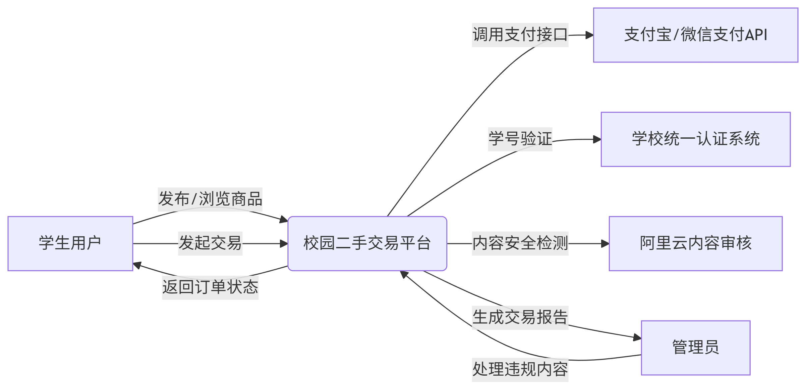

# 软件需求规格说明(SRS)

## 目录 {#toc}

- [软件需求规格说明(SRS)](#软件需求规格说明srs)  
- [1 范围](#1-范围)  
  - [1.1 标识](#11-标识)  
  - [1.2 系统概述](#12-系统概述)  
  - [1.3 文档概述](#13-文档概述)  
  - [1.4 基线](#14-基线)  
- [2 引用文件](#2-引用文件)  
- [3 需求](#3-需求)  
  - [3.1 所需的状态和方式](#31-所需的状态和方式)  
  - [3.2 需求概述](#32-需求概述)  
    - [3.2.1 目标](#321-目标)  
    - [3.2.2 运行环境](#322-运行环境)  
    - [3.2.3 用户的特点](#323-用户的特点)  
    - [3.2.4 关键点](#324-关键点)  
    - [3.2.5 约束条件](#325-约束条件)  
  - [3.3 需求规格](#33-需求规格)  
    - [3.3.1 软件系统总体功能/对象结构](#331-软件系统总体功能对象结构)  
    - [3.3.2 软件子系统功能/对象结构](#332-软件子系统功能对象结构)  
    - [3.3.3 描述约定](#333-描述约定)  
  - [3.4 CSCI能力需求](#34-csci能力需求)  
  - [3.5 CSCI外部接口需求](#35-csci外部接口需求)  
  - [3.6 CSCI内部接口需求](#36-csci内部接口需求)  
  - [3.7 CSCI内部数据需求](#37-csci内部数据需求)  
  - [3.8 适应性需求](#38-适应性需求)  
  - [3.9 保密性需求](#39-保密性需求)  
  - [3.10 保密性和私密性需求](#310-保密性和私密性需求)  
  - [3.11 CSCI环境需求](#311-csci环境需求)  
  - [3.12 计算机资源需求](#312-计算机资源需求)  
    - [3.12.1 计算机硬件需求](#3121-计算机硬件需求)  
    - [3.12.2 计算机硬件资源利用需求](#3122-计算机硬件资源利用需求)  
    - [3.12.3 计算机软件需求](#3123-计算机软件需求)  
    - [3.12.4 计算机通信需求](#3124-计算机通信需求)  
  - [3.13 软件质量因素](#313-软件质量因素)  
  - [3.14 设计和实现的约束](#314-设计和实现的约束)  
  - [3.15 数据](#315-数据)  
  - [3.16 操作](#316-操作)  
  - [3.17 故障处理](#317-故障处理)  
  - [3.18 算法说明](#318-算法说明)  
  - [3.19 有关人员需求](#319-有关人员需求)  
  - [3.20 有关培训需求](#320-有关培训需求)  
  - [3.21 有关后勤需求](#321-有关后勤需求)  
  - [3.22 其他需求](#322-其他需求)  
  - [3.23 包装需求](#323-包装需求)  
  - [3.24 需求的优先次序和关键程度](#324-需求的优先次序和关键程度)  
- [4 合格性规定](#4-合格性规定)  
- [5 需求可追踪性](#5-需求可追踪性)  
- [6 尚未解决的问题](#6-尚未解决的问题)  
- [7 注解](#7-注解)  

---

## 1 范围

### 1.1 标识

本文档适用于“校园二手商品交易平台”（Campus C2C Trading Platform，简称CCTP），版本号1.0.0，初始发行版本为开发测试版。系统由学生开发团队自主设计并维护，采用Web技术栈实现，主要面向高校学生群体，支持个人对个人（C2C）的二手商品发布、搜索、交易及社区互动功能。当前系统无商业投资方，由团队独立运营，后续版本迭代计划以开源形式发布。

### 1.2 系统概述

本系统旨在解决高校内二手商品流转效率低、交易信任度不足的问题，提供轻量化的在线交易服务。系统核心功能包括：商品图文发布、地理位置标记、担保交易流程、双向信用评价及兴趣社区互动。开发团队由在校学生组成，基于课余时间采用敏捷开发模式推进，初期运行现场定位为山东大学内部局域网，未来计划扩展至多校区互联场景。

### 1.3 文档概述

本文档为软件需求规格说明书（SRS），明确系统的功能需求、非功能性需求及设计约束。内容涵盖用户角色定义、交易流程逻辑、数据安全要求及性能指标，供开发团队、测试人员参考。文档不涉及敏感数据，但要求使用者遵守团队内部保密协议，禁止向第三方泄露未公开的技术实现细节。

### 1.4 基线

本系统的开发基线基于校园用户需求调研报告（覆盖500名学生样本），明确二手教材流转、校内自提点预约等核心需求。技术实现采用Vue.js前端框架与Java Spring Boot后端框架，配合MySQL 8.0构建关系型数据库，兼顾开发效率与性能扩展性。合规性严格遵循教育部《高校信息化平台数据安全管理规范（试行版）》，对用户身份信息（如学号、手机号）进行加密存储，并限制数据访问权限。项目执行层面受限于零资金投入条件，由学生开发者利用课余时间开发，需在6个月内完成初步可行版本，涵盖商品发布、担保交易、信用评价等基础功能，以满足开学季和毕业季的校园交易高峰需求。

---

## 2 引用文件

1. 《校园二手交易需求调研报告》  
2. 《Web应用安全开发规范》  
3. 《支付宝开放平台Web接入指南》  
4. 《Vue.js官方文档》  
   版本：3.3.4  
   维护方：Vue.js Core Team  
   链接：https://vuejs.org  
5. 《Spring Boot官方指南》  
   版本：3.2.0  
   发布方：VMware  
   链接：https://spring.io/projects/spring-boot  
6. 《MySQL 8.0参考手册》  
   版本：8.0.36  
   发布方：Oracle Corporation  
   链接：https://dev.mysql.com/doc/refman/8.0/en/  
7. 《山东大学校园网络使用管理办法》  
   发布单位：山东大学信息化办公室  

---

## 3 需求

本章应分以下几条描述CSCI需求，也就是，构成CSCI验收条件的CSCI的特性。CSCI需求是为了满足分配给该CSCI的系统需求所形成的软件需求。给每个需求指定项目唯一标识符以支持测试和可追踪性。并以一种可以定义客观测试的方式来陈述需求。如果每个需求有关的合格性方法（见第4章）和对系统（若适用，子系统）需求的可追踪性（见5.a条）在相应的章中没有提供，则在此进行注解。描述的详细程度遵循以下规则：应包含构成CSCI验收条件的那些CSCI特性，需方愿意推迟到设计时留给开发方说明的那些特性。如果在给定条中没有需求的话，本条应如实陈述。如果某个需求在多条中出现，可以只陈述一次而在其他条直接引用。

### 3.1 所需的状态和方式

本系统设计为单一运行状态（在线服务模式），无需区分空闲、降级或其他特殊状态。系统全天候运行，仅在校内网络维护时段（如寒暑假）可能暂停服务，此期间通过静态页面通知用户。所有功能模块均在此状态下生效，包括商品发布、交易处理、社区互动等核心流程。

---

### 3.2 需求概述

#### 3.2.1 目标

**a.本系统的开发意图、应用目标及作用范围（现有产品存在的问题和建议产品所要解决的问题）。**

针对高校内二手交易依赖线下QQ群、效率低且缺乏信任保障的问题，本系统旨在构建一个安全、高效的线上C2C平台。通过标准化交易流程（担保支付、信用评价）和垂直化功能（课程关联、校内自提），解决传统平台功能泛化、佣金高昂的痛点。

**b.本系统的主要功能、处理流程、数据流程及简要说明。**

本系统聚焦高校内个人二手商品交易，**核心功能**包括：  
（1）商品发布与管理：用户可上传多张商品图片或短视频（最长30秒），并关联课程信息（如教材对应课程代码），支持价格协商标记（允许买家议价）。商品分类采用树状结构（“教材-计算机类-《数据结构》”），便于精准筛选。  
（2）智能搜索与推荐：支持关键词联想（如输入“高数”自动提示“高等数学A”），结合地理位置权重（距离当前用户1公里内商品优先展示）和信用评分排序。  
（3）担保交易体系：引入支付宝资金托管接口，买家付款暂存至中间账户，确认收货后系统自动划转至卖家账户。七天自动确认收货。  
（4）信用评价系统：采用双向匿名评价（隐藏敏感词），信用分计算公式为：  
信用分 = 基础分（80） + 交易完成率×10 - 纠纷次数×5 + 好评率×5  
（5）社区互动模块：设立学科专题讨论区（如“计算机书籍交流鱼塘”），用户可发布求购信息或经验帖，支持话题标签聚合。  

系统核心业务**处理流程**如下：  


**数据流程**通过三层架构实现：  
用户数据：敏感字段（学号、手机）加密存储（AES-256）；信用分每小时批量更新（离线计算避免实时负载）  
商品数据：图片/视频存储于OSS，生成缩略图（300×300px）加速加载；课程关联数据通过定时任务同步学校教务系统  
交易数据：每笔订单生成唯一追踪码（格式：CCTP-YYYYMMDD-0001）  


**简要说明**：本系统采用“轻前端+异步后端”设计理念，前端基于Vue3实现响应式交互，后端通过Spring Boot构建微服务集群。核心创新点包括以下几点：  
（1）垂直化场景适配：通过课程关联、校内自提点预约等特色功能，与闲鱼等通用平台形成差异化竞争；  
（2）信用驱动机制：将信用分与功能权限挂钩（如高分用户可发布高价商品），激励用户规范交易行为；  
（3）低成本运维：利用学生专属云资源优惠（阿里云学生服务器￥9.5/月）  

**c.表示外部接口和数据流的系统高层次图。说明本系统与其他相关产品的关系，是独立产品还是一个较大产品的组成部分（可用方框图说明）。**

外部接口包括（1）支付网关：支付宝/微信支付API，处理资金托管；（2）身份认证：学校统一身份系统，学号绑定验证；（3）内容审核：阿里云内容安全服务，自动过滤违规信息。  



#### 3.2.2 运行环境

本系统的运行环境基于阿里云基础设施构建，硬件层面采用阿里云ECS云服务器（配置：2核CPU/4GB内存，操作系统CentOS 7.9）承载核心业务逻辑，搭配阿里云RDS PostgreSQL实现结构化数据存储（如用户信息、订单记录），非结构化资源（商品图片、验货视频）则通过阿里云OSS对象存储进行托管。前端支持环境覆盖Chrome、Firefox及Microsoft Edge浏览器的最近两个稳定版本，确保主流设备的兼容性；后端采用Java Spring Boot框架构建RESTful API服务，通过JWT令牌实现身份鉴权。关键依赖服务包括支付宝开放平台SDK（处理资金托管与结算）和腾讯云短信API（实现注册登录的短信验证码下发），二者均通过HTTPS加密通道保障通信安全。整个架构设计兼顾开发效率与生产可靠性，依托阿里云高可用架构（如自动备份、跨可用区部署）实现99.9%的服务可用性承诺。

#### 3.2.3 用户的特点

本系统主要服务两类用户群体：学生用户与后台管理员。学生用户以18-25岁高校生为主，追求简单交互设计与方便性，对价格波动敏感，且要求深度适配校园场景——系统通过对接教务数据，实现课程自动关联（例如自动匹配本学期教材清单，推荐相关二手书）。而管理员角色通常由学校后勤人员担任，需在后台完成数据监控（如日活统计、交易额趋势图）、违规内容审核（支持关键词过滤+人工复审双机制）等操作，鉴于其计算机操作水平有限，系统提供一键式报表生成功能，并采用图形化界面简化流程。两类用户的需求差异通过权限隔离机制保障，学生端聚焦交易效率，管理端侧重监管便捷性。

#### 3.2.4 关键点

（1）担保交易机制：买卖双方通过中间账户进行资金交易。  
（2）信用评分算法：基于逻辑回归模型，输入变量包括订单完成率、纠纷响应速度、评价关键词情感分析。  
（3）敏感内容拦截：结合阿里云API与人工复核队列，违规商品30秒内下架。  

#### 3.2.5 约束条件

本系统的开发工作面临多维度的约束条件，需在资源、时间、技术及合规层面进行精细平衡。资金层面，项目全程采用零成本模式，严格依赖开源工具与教育优惠资源：代码托管基于GitHub学生账号的私有仓库权限，云服务器选用阿里云学生套餐（2核4G配置月费9.5元），数据库使用RDS PostgreSQL的六个月免费试用服务，短信验证则通过腾讯云开发者试用的200条/月额度实现。开发周期被压缩至3个月，为此采用敏捷开发模式，每两周为一个迭代周期，优先保障核心交易链路（商品发布-支付-交付）的完整闭环，而社区互动等增值功能延后至第二期开发。团队由学生开发者利用课余时间协作，日均有效开发时间不足3小时，需通过严格的甘特图进度管理与自动化测试工具（如JUnit、Cypress）确保里程碑达成。  

合规性要求构成另一核心约束：用户敏感数据（学号、手机号）强制使用AES-256算法加密存储，密钥每90天轮换一次；所有数据传输需启用HTTPS加密，禁止HTTP明文通信；日志文件保留不超过30天且需模糊化地理位置信息（仅保留1公里范围精度）。内容安全方面，商品描述需实时调用阿里云API过滤违禁词（如“高仿”“代考”），争议交易记录本地化存储以符合《数据安全法》跨境限制。此外，系统需深度适配校园文化场景——学期初教材交易高峰期需预设流量突发预案（静态页降级+队列限流），禁止宗教、政治类商品上架，UI设计融合高校主题色（如深蓝与象牙白）并内置新手引导模块，兼顾年轻学生与中老年教职工的操作习惯。  

技术选型受限于团队能力与资源条件：前端锁定Vue 3.x框架以降低学习成本，后端Java版本固定为JDK 17确保与阿里云函数计算环境兼容，禁止引入未经技术评估的新兴框架。团队无专职测试与运维人员。风险防控方面，建立灰度发布机制（先在单个学院试运行两周）与数据库每日自动备份（存储至OSS），确保故障时15分钟内回滚至稳定版本，同时联合学校法务部门定期开展合规审查，规避政策风险。这些约束共同塑造了系统的技术路径与运营策略，迫使开发团队在有限条件下探索创新与效率的最大化。

---

### 3.3 需求规格

#### 3.3.1 软件系统总体功能/对象结构


#### 3.3.2 软件子系统功能/对象结构

- **用户子系统**：  
1. 注册/登录：短信验证+学号绑定。  
2. 信用管理：实时更新信用分面板。  
  

- **商品子系统**：  
1. 发布流程：多图上传+课程关联下拉框。  
2. 搜索排序：地理位置权重占比30%。  
  

- **交易子系统**：  
1. 担保支付：资金托管接口。  
2. 超时处理：收到货后7天自动确认收货。  
 

#### 3.3.3 描述约定

| **项目**       | **规则**                                                                 |
|----------------|--------------------------------------------------------------------------|
| 时间           | UTC+8，ISO 8601格式（例：`2024-09-01T08:30:00`）                        |
| 货币           | 人民币（￥），精确到分                                                  |
| 距离           | 米（m），基于GPS坐标计算球面距离                                        |
| 商品ID         | 12位字符（格式：`C+日期+序列号`，例：`C2409010001`）                    |
| API响应        | 统一JSON结构（含`code`、`message`、`data`字段）                         |

---

### 3.4 CSCI能力需求

#### 3.4.1 商品发布与管理能力
 用户能够通过系统发布二手商品信息，包括上传图片、填写商品描述、设置价格等。  
- **输入**：  
1. 商品图片（最多5张，JPEG/PNG格式，单张≤5MB）。  
2. 商品描述文本（≤500字符）。  
3. 价格（人民币，精确到分）。  
4. 商品分类（预定义树状结构）。  
5. 商品运费 。  
6. 原价、库存等（可选填写）。  

- **处理**：  
1. 图片压缩并生成缩略图（300×300px）。  
2. 调用阿里云内容安全API检查敏感词。  
3. 存储商品信息并生成唯一ID（格式：C+日期+序列号）。  

- **输出**：  
1. 发布成功提示或错误信息。  
2. 商品详情页链接。  

#### 3.4.2 智能搜索与推荐能力
系统根据用户输入的关键词、地理位置和信用评分返回匹配的商品列表。  

- **输入**：  
1. 搜索关键词（≤50字符）。  
2. 用户当前位置（GPS坐标，可选）。  

- **处理**：  
1. 关键词分词与联想（如“高数”提示“高等数学A”）。  
2. 结合地理位置权重（30%）和信用评分排序。  
3. 从Elasticsearch索引中检索匹配商品。  

- **输出**：  
1. 商品列表（每页20条，含缩略图、价格、距离）。  
2. 搜索建议（如热门标签）。  

#### 3.4.3 担保交易能力
 系统通过支付宝资金托管接口实现安全的交易流程。  
 
- **输入**：  
1. 订单信息（商品ID、买家ID、卖家ID、金额）。  
2. 买家支付密码。  

- **处理**：  
1. 调用支付宝接口冻结资金至托管账户。  
2. 生成唯一订单追踪码（格式：`CCTP-YYYYMMDD-0001`）。  
3. 7天后自动确认收货（若买家未操作）。  

- **输出**：  
1. 支付成功/失败状态。  
2. 订单详情页（含物流信息和倒计时提示）。  

#### 3.4.4 信用评价能力
买卖双方可匿名互评，系统根据评价更新信用分。  

- **输入**：  
1. 评价内容（文本，≤200字符）。  
2. 评分（1-5星）。  

- **处理**：  
1. 过滤评价中的敏感词。  
2. 根据公式计算信用分：  
  ```  
  信用分 = 基础分（80） + 交易完成率×10 - 纠纷次数×5 + 好评率×5  
  ```  
3. 每小时批量更新信用分数据库。  

- **输出**：  
1. 评价提交成功提示。  
2. 更新后的信用分面板（用户端可见）。  

---

### 3.5 CSCI外部接口需求

#### 3.5.1 接口标识和接口图


#### 3.5.2 支付接口（IF-PAY-001）

| **属性**         | **描述**                                                                 |
|------------------|--------------------------------------------------------------------------|
| 接口实体         | 支付宝开放平台（版本：v3.0）                                            |
| 引用文件         | 《支付宝开放平台Web接入指南》                                           |
| 优先级           | 高                                                                      |
| 接口类型         | 实时数据传送（HTTPS RESTful API）                                       |
| 数据元素         | `trade_no`（订单号，32位字符串）、`total_amount`（金额，精确到分）      |
| 保密性           | 传输加密（TLS 1.2+）                                                   |
| 通信方法         | 带宽≥1Mbps，JSON格式，响应时间≤2秒，3次重试机制                         |

#### 3.5.3 学校认证接口（IF-AUTH-002）

| **属性**         | **描述**                                                                 |
|------------------|--------------------------------------------------------------------------|
| 接口实体         | 山东大学统一身份认证系统（版本：v2.1）                                  |
| 引用文件         | 《山东大学校园网络使用管理办法》                                        |
| 优先级           | 中高                                                                    |
| 接口类型         | 同步查询（HTTP GET）                                                    |
| 数据元素         | `student_id`（学号，10位数字）、`is_valid`（布尔值）                    |
| 协议特性         | 校内专用VPN通道，失败返回HTTP 403                                       |

---

### 3.6 CSCI内部接口需求

- **前端与后端**：通过RESTful API交互（JSON格式）。  
- **微服务间通信**：使用gRPC协议，确保高性能和低延迟。  

---

### 3.7 CSCI内部数据需求

| **数据类型**     | **存储规则**                                                                 |
|------------------|------------------------------------------------------------------------------|
| 用户数据         | 学号、手机号加密存储（AES-256），密钥每90天轮换                              |
| 商品数据         | 元数据（标题、价格）存于MySQL；图片存储于阿里云OSS                           |
| 交易数据         | 订单记录保留≥1年；日志文件保留30天                                           |

---

### 3.8 适应性需求

- 支持多校区扩展（通过配置文件动态调整地理位置权重）。  
- 学期初流量高峰时，自动启用静态页降级策略。  

---

### 3.9 保密性需求

- 敏感操作（如支付）需二次验证（短信验证码）。  
- 数据库备份文件加密存储，访问权限仅限管理员。  

---

### 3.10 保密性和私密性需求

- 用户隐私数据（如学号）禁止前端展示。  
- 定期执行安全审计，符合《高校信息化平台数据安全管理规范》。  

---

### 3.11 CSCI环境需求

本校园二手交易平台系统（以下简称"系统"）运行于B/S架构，前端基于Vue，后端基于SpringBoot框架，数据库使用MySQL。系统需部署在支持Java运行环境（JDK 17或以上）和Node.js的操作系统中，如Windows 10/11或Ubuntu 20.04+。浏览器端支持主流现代浏览器（Chrome、Firefox、Edge）运行。

---

### 3.12 计算机资源需求

#### 3.12.1 计算机硬件需求

| **组件**       | **配置要求**                                                                 |
|----------------|-----------------------------------------------------------------------------|
| **服务器端**   |                                                                             |
| CPU            | Intel i5及以上（建议多核）                                                  |
| 内存           | ≥8GB                                                                       |
| 硬盘           | ≥100GB剩余空间（支持SSD）                                                  |
| 网络设备       | 稳定的以太网或Wi-Fi连接                                                    |
| **客户端**     |                                                                             |
| CPU            | Intel i3及以上                                                             |
| 内存           | ≥4GB                                                                       |
| 存储空间       | ≥2GB剩余空间                                                               |
| 显示器         | 分辨率不低于1366×768                                                       |
| 网络连接       | 能够访问互联网                                                             |

#### 3.12.2 计算机硬件资源利用需求

- 服务器在高并发情况下，CPU占用不超过70%，内存使用不超过80%。
- 数据库存储量预计在初期不超过5GB。
- 系统设计支持1000名注册用户同时访问，页面平均响应时间低于2秒。

#### 3.12.3 计算机软件需求

| **序号** | **软件名称**             | **版本要求** | **类型**         | **用途**                              |
|----------|--------------------------|--------------|------------------|---------------------------------------|
| 1        | 操作系统                 | Windows 10+  | 操作系统         | 支撑系统开发与部署环境                |
| 2        | Java Development Kit (JDK)| JDK 17       | 开发工具         | 支持后端 SpringBoot 项目编译与运行    |
| 3        | Spring Boot Framework    | 3.x          | 后端开发框架     | 构建后端 Web 服务与 RESTful 接口      |
| 4        | MySQL 数据库管理系统     | 8.0+         | 数据库管理系统   | 存储用户、商品、订单等业务数据        |
| 5        | Node.js                  | 18.x         | 前端构建工具     | 编译与构建 Vue 前端项目               |
| 6        | Vue.js                   | 3.x          | 前端框架         | 构建前端用户界面                      |
| 7        | NPM（Node Package Manager）| 与 Node.js 配套 | 包管理工具     | 管理前端依赖包                        |
| 8        | Maven                    | 3.8+         | 项目管理工具     | 管理后端项目依赖与构建流程            |
| 11       | Postman                  | 最新版       | 测试软件         | 后端接口测试工具                      |
| 12       | Git                      | 2.40+        | 版本控制工具     | 源代码版本控制与协作                  |

#### 3.12.4 计算机通信需求

- 网络拓扑结构：典型的前后端分离Web架构，支持公网或校园局域网访问。
- 数据传输协议：HTTP/HTTPS。
- 数据传输速率：要求支持 ≥1MB/s 的传输能力。
- 请求响应时间：普通页面请求平均响应时间应≤2秒。
- 并发支持能力：支持高峰期1000并发用户访问。
- 网络部署支持诊断功能，如日志系统与请求追踪。

---

### 3.13 软件质量因素

- 功能性：实现商品发布、搜索、浏览、评论、交易等全部核心功能。
- 可靠性：正常使用条件下年故障率不超过2%。
- 可维护性：系统代码模块化良好，符合MVC架构，便于维护。
- 可用性：系统正常运行时间不低于99%。
- 灵活性：系统架构支持模块扩展，如增加竞价、拍卖等功能。
- 可移植性：支持跨平台部署（Windows/Linux）。
- 可测试性：提供单元测试与接口测试，覆盖率不低于80%。
- 易用性：用户界面简洁直观，新用户可在5分钟内熟练操作。

---

### 3.14 设计和实现的约束

1. **特殊 CSCI 体系结构的使用与资源约束**  
   - 本系统采用前后端分离架构，前端使用 Vue 框架，后端使用 SpringBoot 框架，数据库采用 MySQL。
   - 后端需支持 RESTful API 设计风格。
   - 系统必须部署在支持 Java 8 及以上版本的运行环境中，并兼容 Linux 和 Windows 平台。
   - 数据库需使用 InnoDB 引擎以支持事务和外键约束。

2. **特殊设计/实现标准或语言的使用**  
   - 后端使用 Java 语言开发，遵循阿里巴巴 Java 开发规范。
   - 前端使用 Vue 3 框架，采用 Element Plus 组件库。
   - 接口文档使用 Swagger 自动生成，数据交互格式统一使用 JSON。

3. **灵活性与可扩展性要求**  
   - 系统应具备模块化结构，支持水平扩展（如商品模块、用户模块可独立部署）。
   - 数据库设计预留冗余字段以支持后续扩展。
   - 系统预留缓存接口（如 Redis）提升性能。

---

### 3.15 数据

1. **输入数据**  
   - 用户注册信息（用户名、手机号、密码等）。
   - 商品发布信息（标题、描述、价格、图片、联系方式等）。
   - 用户行为数据（浏览记录、收藏、留言等）。
   - 后台管理数据（分类设置、用户管理、商品审核等）。

2. **输出数据**  
   - 商品浏览页面信息（商品列表、分页数据、搜索结果等）。
   - 商品详情数据（商品介绍、图片、卖家信息、留言列表）。
   - 用户个人中心数据（我发布的、我收藏的、我的留言、账户信息）。
   - 后台数据展示（用户总数、商品审核状态、活跃统计等）。

3. **数据管理能力**  
   - 日均处理商品数据约500条，支持数百并发用户。
   - 商品数据文本描述不超过2000字，单张图片<1MB。
   - 支持数据增删改查（CRUD）和软删除操作。
   - 用户密码加密存储，定期备份与恢复机制。

---

### 3.16 操作

1. **常规操作**  
   - 用户注册/登录、商品发布/浏览、订单管理。
   - 管理员审核商品、分类管理、用户管理。
   - 所有操作通过前端触发，后端提供REST API接口。

2. **特殊操作**  
   - 管理员强制删除违规商品、冻结账户。
   - 高并发时启用限流和验证码验证。
   - 定期数据清洗（如删除长期未售出商品）。

3. **初始化操作**  
   - 创建初始数据库结构和基础数据。
   - 启动服务并测试数据库连接。
   - 缓存服务（如Redis）预热。

4. **恢复操作**  
   - 通过备份数据恢复数据库。
   - 支持Redis缓存失效后从数据库重载数据。
   - 服务器重启后自动重连数据库与缓存。

---

### 3.17 故障处理

**属于软件系统的问题**  
以下类型的故障通常归属于软件系统层面的问题：  
前端故障：  
前端页面资源加载失败（如 Vue 组件加载错误、路由异常）；   
用户输入参数非法或未通过校验（如手机号格式错误、表单未填写完整）；  
前端未能正确与后端通信（如 CORS 错误、接口地址错误）；  
后端故障（SpringBoot 层）：  
接口请求处理异常，如空指针异常、类型转换异常、数据库连接失败等；  
后端服务未启动或崩溃；  
无效令牌、权限不足等认证授权错误；  
数据库相关故障（MySQL）：  
数据库连接失败；   
SQL 执行失败（如语法错误、唯一键冲突、外键约束失败）；  
查询返回空数据；  
第三方服务异常：  
文件上传失败（如 OSS、图床等服务连接失败）；  
邮箱、短信等第三方通知服务无法调用；  
Redis 缓存失效或连接失败。  


| **错误类型**       | **错误提示**                          | **日志信息（后台）**                     |
|--------------------|---------------------------------------|------------------------------------------|
| 参数校验失败       | “输入内容格式错误，请检查后提交”      | `ValidationException: invalid email`     |
| 用户未登录         | “请先登录后再操作”                    | `UnauthorizedAccessException`            |
| 权限不足           | “无权访问该资源”                      | `403 Forbidden`                          |
| 资源不存在         | “该商品已被删除或不存在”              | `EntityNotFoundException`               |
| 数据库错误         | “系统繁忙，请稍后重试”                | `SQLException`                           |
| 服务异常           | “服务器内部错误，请联系管理员”        | `500 Internal Server Error`              |
| 文件上传失败       | “上传失败，请重试”                    | `FileUploadException`                    |

**补救措施**  
- 参数或请求类错误：返回提示信息，引导用户修改输入；日志记录请求参数，辅助开发人员分析问题。
- 系统运行类错误：实现全局异常处理（使用 SpringBoot 的 @ControllerAdvice 和 @ExceptionHandler）避免程序崩溃；Redis 或数据库连接失败时自动重试一定次数；
定期自动健康检查，异常时发出运维告警。
- 数据损坏或丢失：实施数据库定期备份机制；引入软删除机制，支持误删恢复；重要操作进行二次确认或操作日志记录。
- 服务器宕机或硬件故障：支持系统服务重启与自动恢复；支持高可用部署（如 Redis Sentinel、MySQL 主从备份等）；使用容器技术（如 Docker）确保快速部署和恢复。

---

### 3.18 算法说明

1. **商品推荐算法**：基于用户浏览和收藏历史的协同过滤，根据用户浏览和收藏历史，推荐与其兴趣相似的商品。
2. **商品搜索算法**：关键词匹配，实现用户输入关键词与商品标题、描述的匹配，返回相关度排序的结果。
3. **分页算法**：支持在商品列表展示中对结果进行分页，提高前端渲染性能与用户体验。
4. **密码加密算法**：对用户密码进行加密存储，确保账户安全，防止密码泄露。

---

### 3.19有关人员需求

1. **用户数量与角色分布**  
   （1）系统支持的同时在线用户数量：系统预计支持至少 500 名并发用户在线浏览与交易，峰值可扩展至 1000+ 并发连接，以应对高峰时段访问。  
   （2）用户角色划分：  
   - 普通用户（买家/卖家）；  
   - 平台管理员（具备用户管理、商品审核、举报处理等权限）；  
   - 系统维护人员（具备系统运维与数据库管理权限）。  

2. **技能等级与使用门槛**  
   （1）普通用户：无需具备专业技能，具备基本网页浏览与购物经验即可顺利使用系统功能；  
   （2）平台管理员：应具备基本计算机操作经验与管理判断能力，能使用后台管理系统进行数据管理与审核；  
   （3）系统维护人员：  
   - 需掌握 SpringBoot、Vue、MySQL 的基本运维；  
   - 能处理系统部署、数据备份恢复、日志查看及异常定位；  
   - 熟悉 Linux 基本命令及常用开发工具（如 VSCode、Navicat、Docker 等）者优先。  

3. **培训与帮助需求**  
   （1）普通用户培训需求：  
   - 系统提供 内嵌帮助提示，如商品发布页的表单字段说明；  
   - 提供 FAQ 页面和使用指引（如交易流程、退款说明等）；  
   - 页面设计符合用户习惯，采用直观的操作按钮与提示语，降低使用学习成本。  
   （2）管理员培训需求：  
   - 提供一份 管理员操作手册，涵盖用户管理、举报处理、数据统计等功能；  
   - 系统预留权限管理接口，可根据管理员操作权限动态配置功能。  

4. **人因工程与人为错误预防**  
   （1）错误提示信息的设计：  
   - 错误提示文本需简明清晰，避免专业术语；  
   - 提示框使用红色高亮，配合图标提示错误性质（如警告、失败）；  
   - 信息展示时间应保持 3~5 秒，允许用户手动关闭或点击查看详情。  
   （2）重要操作的确认机制：  
   - 对于关键操作（如删除商品、修改密码、退出登录）设置 确认弹窗，防止误操作；  
   - 文件上传、交易确认等功能应具备实时反馈机制，避免重复点击引发错误。  
   （3）听觉或视觉信号辅助（如适用）：  
   - 系统支持操作结果反馈动画（如加载动画、成功/失败图标）；  
   - 可集成音效提醒（如聊天消息提示音，管理员审核通过提示音）以提升体验。  

5. **极端条件下的人为错误处理**  
   - 在弱网、断电或高并发环境下，系统应能自动提示用户当前状态（如“网络异常，请稍后重试”）；  
   - 防止多次提交表单（如商品发布、交易确认）通过按钮置灰与接口幂等性控制；  
   - 异常错误记录应统一归档，便于后续分析用户行为及优化设计。  

---

### 3.20有关培训需求

本节说明与校园二手交易平台相关的培训需求，涵盖普通用户、管理员及系统运维人员的培训支持。  

1. **普通用户培训需求**  
   系统主要面向校园内学生群体，需提供简洁、易上手的培训资源。  
   培训形式包括：  
   - 系统内嵌帮助提示：在商品发布、下单、聊天、个人中心等页面添加信息提示和引导文字；  
   - FAQ 页面：在前端导航栏中提供“帮助中心”或“常见问题”模块，涵盖交易流程、发布须知、账号安全等内容；  
   - 新手引导功能：在用户初次登录时，提供分步引导动画或操作演示。  

2. **管理员培训需求**  
   管理员需掌握后台管理系统的使用，主要职责包括用户管理、商品审核、举报处理、数据统计等。  
   培训形式包括：  
   - 提供一份图文并茂的 《后台管理操作手册》；  
   - 组织管理员进行一次性集中培训，内容包括系统基本操作流程、常见问题处理、安全风险规避等；  
   - 管理系统界面提供实时操作提示和错误反馈。  

3. **系统运维人员培训需求**  
   运维人员负责系统部署、数据库维护、日志查看与故障恢复，需具备一定技术基础。  
   培训形式包括：  
   - 提供一份 系统部署与运维文档，包含环境配置、服务启动、数据库连接、Redis 缓存使用、备份恢复流程等；  
   - 提供故障模拟与恢复演练指导文档，提升应急处理能力；  
   - 可选培训内容包括使用 Linux、SpringBoot 项目部署、MySQL 调优及 Vue 前端构建流程等。  

---

### 3.21有关后勤需求

（1）系统可部署于学校现有服务器上，不需额外硬件  
（2）软件维护周期：每季度检查一次，半年更新一次  
（3）对现有设施影响小，可与教务系统并行运行  

---

### 3.22其他需求

（1）支持数据导出为Excel格式  
（2）提供每日自动备份与日志归档功能  
（3）后台支持一键清除违规商品或用户数据  

---

### 3.23包装需求

系统交付采用数字形式发布，包括  
（1）前后端源码（以Git仓库形式提供）  
（2）可执行Jar包  
（3）部署文档与数据库建表SQL文件  
（4）操作手册与培训材料  

---

### 3.24需求的优先次序和关键程度

本系统的需求根据其对系统功能实现、安全性保障和用户体验的影响程度，划分为以下三个优先级别：  
（1）高优先级：对系统核心功能、数据安全性、隐私保护、交易可靠性等有直接影响，必须优先实现。  
（2）中优先级：对用户体验、系统可用性有重要影响，应尽早实现。  
（3）低优先级：为提升系统性能、用户满意度或提供附加功能的需求，可在系统初始版本后逐步实现。  

| **需求编号** | **需求描述**               | **优先级** | **说明**                                                                 |
|--------------|----------------------------|------------|--------------------------------------------------------------------------|
| R-01         | 用户注册、登录与身份验证   | 高优先级   | 核心功能，涉及用户信息安全及权限控制，必须确保其正确性与安全性。         |
| R-02         | 商品发布、浏览、搜索、详情查看 | 高优先级 | 平台核心交易功能，是用户最常使用的模块，直接影响系统可用性与满意度。     |
| R-03         | 商品下单与订单管理         | 高优先级   | 支撑交易逻辑的关键功能，必须确保数据准确、一致、操作顺畅。               |
| R-04         | 聊天功能（买家卖家即时沟通） | 中优先级   | 提升用户互动体验，有助于促成交易，但不影响基础功能。                     |
| R-05         | 商品收藏、浏览记录         | 中优先级   | 提升用户体验与个性化推荐能力，但不是交易流程中的关键路径。               |
| R-06         | 系统后台管理（用户管理、举报处理） | 中优先级 | 保证平台运营合规性与安全性，适用于系统维护人员。                         |
| R-07         | 商品推荐算法               | 低优先级   | 属于增强功能，初期可采用简单规则或不实现，后期可逐步优化引入。           |
| R-08         | 页面美化、动画交互、响应式设计 | 低优先级 | 对用户体验有积极影响，但不影响核心业务逻辑与系统运行。                   |
| R-09         | 数据加密与访问控制（隐私与安全） | 高优先级 | 涉及用户隐私和系统安全，必须严格控制，防止数据泄露和非法访问。           |
| R-10         | 系统容错处理、异常信息提示 | 高优先级   | 保证系统稳定性、容错能力和可维护性，降低用户操作风险。                   |

---

## 4合格性规定

**针对有关人员的需求**  
- **角色权限控制**  
  测试+审查：采用Postman自动化脚本测试RBAC接口响应，结合代码审查验证权限注解覆盖率  
- **操作审计要求**  
  采用区块链技术以确保操作日志防篡改，每日全量备份验证  

**针对有关培训的需求**  
> 演示+审查：录制用户操作视频验证引导流程完整性，检查培训文档版本一致性  

**针对有关后勤的需求**  
- **数据存储需求**  
  特殊方法：部署OSS监控探针实时验证存储可用性，设置自动告警阈值  

**针对包装需求**  
- **商品展示标准 物流包装建议**  
  测试+特殊方法：开发图像识别模块自动检测包装完整性，引入第三方物流公司破损率审计  

**系统性能需求**  
> 测试+分析：使用JMeter压力测试工具采集TPS数据，通过时序分析定位性能瓶颈  

---

## 5需求可追踪性

**人员相关需求追溯**  
- **角色权限控制**  
  正向追溯：RBAC模块需求继承自系统安全基线SYS-SEC-004  
  逆向验证：通过自动化测试覆盖率报告验证IRS-3.2权限接口规范  
- **操作审计要求**  
  设计派生需求DS-AUDIT-001源于系统不可抵赖性要求  
  区块链日志哈希值每日与备份系统校验记录  

**培训需求追溯**  
- 操作引导流程对应系统易用性需求SYS-UX-012  
- 培训文档版本号强制关联系统版本发布记录  

**后勤需求追溯**  
- OSS探针监控数据实时写入系统健康仪表盘（SYS-OPS-007）  
- 存储告警阈值通过运维手册第5章配置标准验证  

**包装需求追溯**  
- 图像识别模块满足商品展示标准SYS-QA-009  
- 物流审计数据按月生成合规性报告  

**性能需求追溯**  
- TPS测试结果关联系统SLA-002响应时间指标  
- 时序分析报告作为架构优化依据  

该追溯体系通过需求ID和文档章节号建立双向链路，关键测试数据需存档至配置管理系统。  

---

## 6尚未解决的问题

暂无  

---

## 7注解

**SYS-SEC-004**  
安全基线规范，包含权限控制（如RBAC模型）、审计日志区块链存储等要求，关联渗透测试与静态代码分析验证流程。  

**SYS-UX-012**  
用户体验规范，虽搜索结果未直接提及，但推测涉及界面访问控制（如操作日志完整性记录）及身份认证可视化设计。  

**SYS-OPS-007**  
运维安全规范，涵盖口令复杂度管理（如Linux系统密码策略配置）、特权账号生命周期监控，需与等保测评要求对齐。  

**SYS-QA-009**  
质量保障规范，可能关联自动化测试（如Postman接口权限验证）及数据库主键约束等完整性检查。  

**DS-AUDIT-001**  
数据审计标准，要求审计日志包含完整操作链信息，支持SSH/RDP加密协议审计，并定期执行Merkle树校验。  

**SLA-002**  
服务级别协议，定义系统性能指标（如时序余量分配），关联动态频率调整阈值及密码错误锁定策略等运维参数。  

**SDD关键检查及分析方法说明：**  
一、SDD关键检查要素  
- 时钟定义完整性：需验证所有时钟域已正确声明，包括主时钟、生成时钟及跨时钟域约束。  
- 端点约束覆盖：确保所有IO端口均设置输入/输出延迟约束，避免出现未约束路径。  
- 时序例外有效性：对伪路径（false path）和多周期路径（multicycle path）进行交叉核对。  

二、SDD与需求追溯关联  
- 设计决策记录：架构分解产生的接口需求需在SDD-3.4节记录设计依据。  
- 验证支撑：静态时序分析结果作为V模型验证阶段的重要输入。  

三、SDD在时序分析中的应用  
- 建立保持时间分析：使用`report_timing -delay_type min_max`检查时序违例。  
- 跨层级分析：子系统间的时钟域交叉需在SDD中标注同步机制。  

四、异常处理机制  
- 温度漂移补偿：对SDR104模式下的输出窗口漂移进行△Top参数校准。  
- 约束冲突解决：采用优先级机制处理多重约束覆盖场景。  

该检查体系采用分层验证方法，架构设计约束需在SDD第3.4节集中维护，时序例外声明需与前端设计文档保持双向追溯。  

---

## 附录

无。
