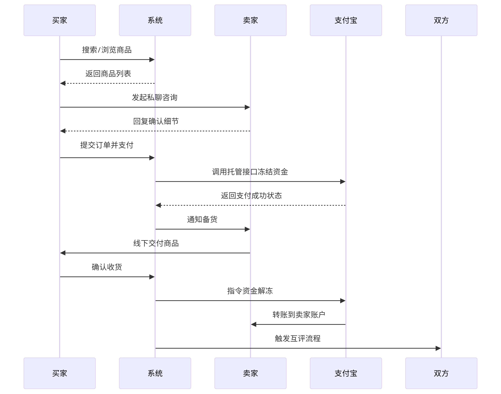

# 软件需求规格说明(SRS)

## 目录 {#目录 .TOC-标题}

[软件需求规格说明(SRS) [1](#_Toc235938903)](#_Toc235938903)  
[1 范围 [3](#_Toc235938904)](#_Toc235938904)  
[1.1 标识 [3](#_Toc235938905)](#_Toc235938905)  
[1.2 系统概述 [3](#_Toc235938906)](#_Toc235938906)  
[1.3 文档概述 [3](#_Toc235938907)](#_Toc235938907)  
[1.4 基线 [3](#_Toc235938908)](#_Toc235938908)  
[2 引用文件 [3](#_Toc235938909)](#_Toc235938909)  
[3 需求 [3](#_Toc235938910)](#_Toc235938910)  
[3.1 所需的状态和方式 [4](#_Toc235938911)](#_Toc235938911)  
[3.2 需求概述 [4](#_Toc235938912)](#_Toc235938912)  
[3.2.1 目标 [4](#_Toc235938913)](#_Toc235938913)  
[3.2.2 运行环境 [4](#_Toc235938914)](#_Toc235938914)  
[3.2.3 用户的特点 [4](#_Toc235938915)](#_Toc235938915)  
[3.2.4 关键点 [4](#_Toc235938916)](#_Toc235938916)  
[3.2.5 约束条件 [4](#_Toc235938917)](#_Toc235938917)  
[3.3 需求规格 [5](#_Toc235938918)](#_Toc235938918)  
[3.3.1 软件系统总体功能/对象结构 [5](#_Toc235938919)](#_Toc235938919)  
[3.3.2 软件子系统功能/对象结构 [5](#_Toc235938920)](#_Toc235938920)  
[3.3.3 描述约定 [5](#_Toc235938921)](#_Toc235938921)  
[3.4 CSCI能力需求 [5](#_Toc235938922)](#_Toc235938922)  
[3.5 CSCI外部接口需求 [6](#_Toc235938923)](#_Toc235938923)  
[3.5.1 接口标识和接口图 [6](#csci外部接口需求)](#csci外部接口需求)  
[3.6 CSCI内部接口需求 [7](#_Toc235938925)](#_Toc235938925)  
[3.7 CSCI内部数据需求 [8](#_Toc235938926)](#_Toc235938926)  
[3.8 适应性需求 [8](#_Toc235938927)](#_Toc235938927)  
[3.9 保密性需求 [8](#_Toc235938928)](#_Toc235938928)  
[3.10 保密性和私密性需求 [8](#_Toc235938929)](#_Toc235938929)  
[3.11 CSCI环境需求 [8](#_Toc235938930)](#_Toc235938930)  
[3.12 计算机资源需求 [8](#_Toc235938931)](#_Toc235938931)  
[3.12.1 计算机硬件需求 [8](#_Toc235938932)](#_Toc235938932)  
[3.12.2 计算机硬件资源利用需求 [9](#_Toc235938933)](#_Toc235938933)  
[3.12.3 计算机软件需求 [9](#_Toc235938934)](#_Toc235938934)  
[3.12.4 计算机通信需求 [9](#_Toc235938935)](#_Toc235938935)  
[3.13 软件质量因素 [9](#_Toc235938936)](#_Toc235938936)  
[3.14 设计和实现的约束 [9](#_Toc235938937)](#_Toc235938937)  
[3.15 数据 [9](#_Toc235938938)](#_Toc235938938)  
[3.16 操作 [10](#_Toc235938939)](#_Toc235938939)  
[3.17 故障处理 [10](#_Toc235938940)](#_Toc235938940)  
[3.18 算法说明 [10](#_Toc235938941)](#_Toc235938941)  
[3.19 有关人员需求 [10](#_Toc235938942)](#_Toc235938942)  
[3.20 有关培训需求 [10](#_Toc235938943)](#_Toc235938943)  
[3.21 有关后勤需求 [10](#_Toc235938944)](#_Toc235938944)  
[3.22 其他需求 [10](#_Toc235938945)](#_Toc235938945)  
[3.23 包装需求 [11](#_Toc235938946)](#_Toc235938946)  
[3.24 需求的优先次序和关键程度 [11](#_Toc235938947)](#_Toc235938947)  
[4 合格性规定 [11](#_Toc235938948)](#_Toc235938948)  
[5 需求可追踪性 [11](#_Toc235938949)](#_Toc235938949)  
[6 尚未解决的问题 [12](#_Toc235938950)](#_Toc235938950)  
[7 注解 [12](#_Toc235938951)](#_Toc235938951)  
[附录 [12](#_Toc235938952)](#_Toc235938952)  

---

## 1 范围

### 1.1 标识

本文档适用于“校园二手商品交易平台”（Campus C2C Trading Platform，简称CCTP），版本号1.0.0，初始发行版本为开发测试版。系统由学生开发团队自主设计并维护，采用Web技术栈实现，主要面向高校学生群体，支持个人对个人（C2C）的二手商品发布、搜索、交易及社区互动功能。当前系统无商业投资方，由团队独立运营，后续版本迭代计划以开源形式发布。

### 1.2 系统概述

本系统旨在解决高校内二手商品流转效率低、交易信任度不足的问题，提供轻量化的在线交易服务。系统核心功能包括：商品图文发布、地理位置标记、担保交易流程、双向信用评价及兴趣社区互动。开发团队由在校学生组成，基于课余时间采用敏捷开发模式推进，初期运行现场定位为山东大学内部局域网，未来计划扩展至多校区互联场景。

### 1.3 文档概述

本文档为软件需求规格说明书（SRS），明确系统的功能需求、非功能性需求及设计约束。内容涵盖用户角色定义、交易流程逻辑、数据安全要求及性能指标，供开发团队、测试人员参考。文档不涉及敏感数据，但要求使用者遵守团队内部保密协议，禁止向第三方泄露未公开的技术实现细节。

### 1.4 基线

本系统的开发基线基于校园用户需求调研报告（覆盖500名学生样本），明确二手教材流转、校内自提点预约等核心需求。技术实现采用Vue.js前端框架与Java Spring Boot后端框架，配合MySQL 8.0构建关系型数据库，兼顾开发效率与性能扩展性。合规性严格遵循教育部《高校信息化平台数据安全管理规范（试行版）》，对用户身份信息（如学号、手机号）进行加密存储，并限制数据访问权限。项目执行层面受限于零资金投入条件，由学生开发者利用课余时间开发，需在6个月内完成初步可行版本，涵盖商品发布、担保交易、信用评价等基础功能，以满足开学季和毕业季的校园交易高峰需求。

---

## 2 引用文件

1. 《校园二手交易需求调研报告》  
2. 《Web应用安全开发规范》  
3. 《支付宝开放平台Web接入指南》  
4. 《Vue.js官方文档》  
   版本：3.3.4  
   维护方：Vue.js Core Team  
   链接：https://vuejs.org  
5. 《Spring Boot官方指南》  
   版本：3.2.0  
   发布方：VMware  
   链接：https://spring.io/projects/spring-boot  
6. 《MySQL 8.0参考手册》  
   版本：8.0.36  
   发布方：Oracle Corporation  
   链接：https://dev.mysql.com/doc/refman/8.0/en/  
7. 《山东大学校园网络使用管理办法》  
   发布单位：山东大学信息化办公室  

---

## 3 需求

本章应分以下几条描述CSCI需求，也就是，构成CSCI验收条件的CSCI的特性。CSCI需求是为了满足分配给该CSCI的系统需求所形成的软件需求。给每个需求指定项目唯一标识符以支持测试和可追踪性。并以一种可以定义客观测试的方式来陈述需求。如果每个需求有关的合格性方法（见第4章）和对系统（若适用，子系统）需求的可追踪性（见5.a条）在相应的章中没有提供，则在此进行注解。描述的详细程度遵循以下规则：应包含构成CSCI验收条件的那些CSCI特性，需方愿意推迟到设计时留给开发方说明的那些特性。如果在给定条中没有需求的话，本条应如实陈述。如果某个需求在多条中出现，可以只陈述一次而在其他条直接引用。

### 3.1 所需的状态和方式

本系统设计为单一运行状态（在线服务模式），无需区分空闲、降级或其他特殊状态。系统全天候运行，仅在校内网络维护时段（如寒暑假）可能暂停服务，此期间通过静态页面通知用户。所有功能模块均在此状态下生效，包括商品发布、交易处理、社区互动等核心流程。

### 3.2 需求概述

#### 3.2.1 目标

**a.本系统的开发意图、应用目标及作用范围（现有产品存在的问题和建议产品所要解决的问题）。**

针对高校内二手交易依赖线下QQ群、效率低且缺乏信任保障的问题，本系统旨在构建一个安全、高效的线上C2C平台。通过标准化交易流程（担保支付、信用评价）和垂直化功能（课程关联、校内自提），解决传统平台功能泛化、佣金高昂的痛点。

**b.本系统的主要功能、处理流程、数据流程及简要说明。**

本系统聚焦高校内个人二手商品交易，**核心功能**包括：  
（1）商品发布与管理：用户可上传多张商品图片或短视频（最长30秒），并关联课程信息（如教材对应课程代码），支持价格协商标记（允许买家议价）。商品分类采用树状结构（“教材-计算机类-《数据结构》”），便于精准筛选。  
（2）智能搜索与推荐：支持关键词联想（如输入“高数”自动提示“高等数学A”），结合地理位置权重（距离当前用户1公里内商品优先展示）和信用评分排序。  
（3）担保交易体系：引入支付宝资金托管接口，买家付款暂存至中间账户，确认收货后系统自动划转至卖家账户。七天自动确认收货。  
（4）信用评价系统：采用双向匿名评价（隐藏敏感词），信用分计算公式为：  
信用分 = 基础分（80） + 交易完成率×10 - 纠纷次数×5 + 好评率×5  
（5）社区互动模块：设立学科专题讨论区（如“计算机书籍交流鱼塘”），用户可发布求购信息或经验帖，支持话题标签聚合。  

系统核心业务**处理流程**如下：  
{width="5.768055555555556in" height="4.543030402449694in"}  

**数据流程**通过三层架构实现：  
用户数据：敏感字段（学号、手机）加密存储（AES-256）；信用分每小时批量更新（离线计算避免实时负载）  
商品数据：图片/视频存储于OSS，生成缩略图（300×300px）加速加载；课程关联数据通过定时任务同步学校教务系统  
交易数据：每笔订单生成唯一追踪码（格式：CCTP-YYYYMMDD-0001）  

{width="5.768055555555556in" height="3.99623687664042in"}  

**简要说明**：本系统采用“轻前端+异步后端”设计理念，前端基于Vue3实现响应式交互，后端通过Spring Boot构建微服务集群。核心创新点包括以下几点：  
（1）垂直化场景适配：通过课程关联、校内自提点预约等特色功能，与闲鱼等通用平台形成差异化竞争；  
（2）信用驱动机制：将信用分与功能权限挂钩（如高分用户可发布高价商品），激励用户规范交易行为；  
（3）低成本运维：利用学生专属云资源优惠（阿里云学生服务器￥9.5/月）  

**c.表示外部接口和数据流的系统高层次图。说明本系统与其他相关产品的关系，是独立产品还是一个较大产品的组成部分（可用方框图说明）。**

外部接口包括（1）支付网关：支付宝/微信支付API，处理资金托管；（2）身份认证：学校统一身份系统，学号绑定验证；（3）内容审核：阿里云内容安全服务，自动过滤违规信息。  

#### 3.2.2 运行环境

本系统的运行环境基于阿里云基础设施构建，硬件层面采用阿里云ECS云服务器（配置：2核CPU/4GB内存，操作系统CentOS 7.9）承载核心业务逻辑，搭配阿里云RDS PostgreSQL实现结构化数据存储（如用户信息、订单记录），非结构化资源（商品图片、验货视频）则通过阿里云OSS对象存储进行托管。前端支持环境覆盖Chrome、Firefox及Microsoft Edge浏览器的最近两个稳定版本，确保主流设备的兼容性；后端采用Java Spring Boot框架构建RESTful API服务，通过JWT令牌实现身份鉴权。关键依赖服务包括支付宝开放平台SDK（处理资金托管与结算）和腾讯云短信API（实现注册登录的短信验证码下发），二者均通过HTTPS加密通道保障通信安全。整个架构设计兼顾开发效率与生产可靠性，依托阿里云高可用架构（如自动备份、跨可用区部署）实现99.9%的服务可用性承诺。

#### 3.2.3 用户的特点

本系统主要服务两类用户群体：学生用户与后台管理员。学生用户以18-25岁高校生为主，追求简单交互设计与方便性，对价格波动敏感，且要求深度适配校园场景——系统通过对接教务数据，实现课程自动关联（例如自动匹配本学期教材清单，推荐相关二手书）。而管理员角色通常由学校后勤人员担任，需在后台完成数据监控（如日活统计、交易额趋势图）、违规内容审核（支持关键词过滤+人工复审双机制）等操作，鉴于其计算机操作水平有限，系统提供一键式报表生成功能，并采用图形化界面简化流程。两类用户的需求差异通过权限隔离机制保障，学生端聚焦交易效率，管理端侧重监管便捷性。

#### 3.2.4 关键点

（1）担保交易机制：买卖双方通过中间账户进行资金交易。  
（2）信用评分算法：基于逻辑回归模型，输入变量包括订单完成率、纠纷响应速度、评价关键词情感分析。  
（3）敏感内容拦截：结合阿里云API与人工复核队列，违规商品30秒内下架。  

#### 3.2.5 约束条件

本系统的开发工作面临多维度的约束条件，需在资源、时间、技术及合规层面进行精细平衡。资金层面，项目全程采用零成本模式，严格依赖开源工具与教育优惠资源：代码托管基于GitHub学生账号的私有仓库权限，云服务器选用阿里云学生套餐（2核4G配置月费9.5元），数据库使用RDS PostgreSQL的六个月免费试用服务，短信验证则通过腾讯云开发者试用的200条/月额度实现。开发周期被压缩至3个月，为此采用敏捷开发模式，每两周为一个迭代周期，优先保障核心交易链路（商品发布-支付-交付）的完整闭环，而社区互动等增值功能延后至第二期开发。团队由学生开发者利用课余时间协作，日均有效开发时间不足3小时，需通过严格的甘特图进度管理与自动化测试工具（如JUnit、Cypress）确保里程碑达成。  

合规性要求构成另一核心约束：用户敏感数据（学号、手机号）强制使用AES-256算法加密存储，密钥每90天轮换一次；所有数据传输需启用HTTPS加密，禁止HTTP明文通信；日志文件保留不超过30天且需模糊化地理位置信息（仅保留1公里范围精度）。内容安全方面，商品描述需实时调用阿里云API过滤违禁词（如“高仿”“代考”），争议交易记录本地化存储以符合《数据安全法》跨境限制。此外，系统需深度适配校园文化场景——学期初教材交易高峰期需预设流量突发预案（静态页降级+队列限流），禁止宗教、政治类商品上架，UI设计融合高校主题色（如深蓝与象牙白）并内置新手引导模块，兼顾年轻学生与中老年教职工的操作习惯。  

技术选型受限于团队能力与资源条件：前端锁定Vue 3.x框架以降低学习成本，后端Java版本固定为JDK 17确保与阿里云函数计算环境兼容，禁止引入未经技术评估的新兴框架。团队无专职测试与运维人员。风险防控方面，建立灰度发布机制（先在单个学院试运行两周）与数据库每日自动备份（存储至OSS），确保故障时15分钟内回滚至稳定版本，同时联合学校法务部门定期开展合规审查，规避政策风险。这些约束共同塑造了系统的技术路径与运营策略，迫使开发团队在有限条件下探索创新与效率的最大化。

### 3.3 需求规格

#### 3.3.1 软件系统总体功能/对象结构

{
